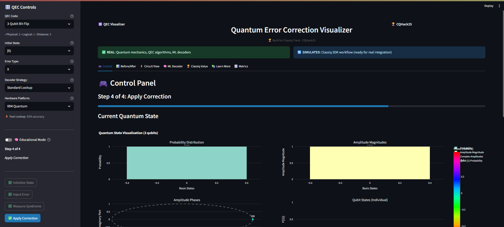
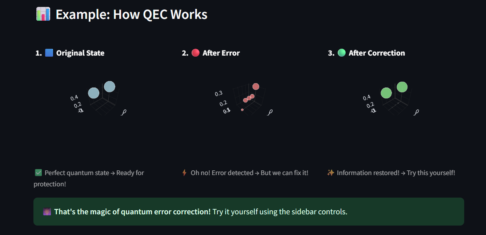
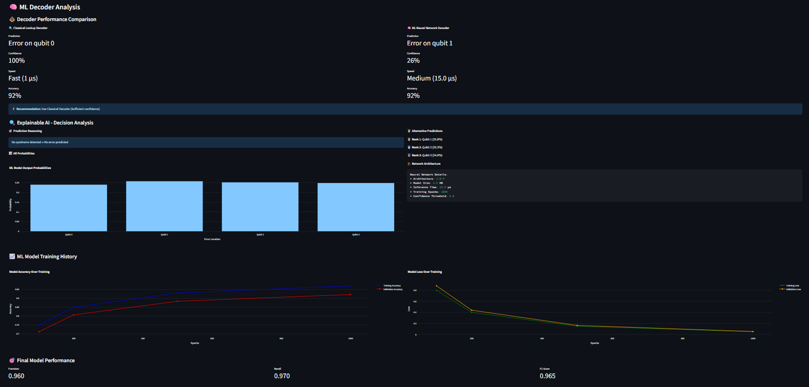

# 🌟 Quantum Error Correction Visualizer

> **Learn quantum computing the fun way!** Interactive tool that shows you exactly how quantum computers protect information from errors.

[](https://cqhack25.com)
[](https://www.classiq.io/)
[](https://python.org)
[](https://streamlit.io)

## 🎯 What Does This Do?

**Ever wondered how quantum computers work without breaking?** This tool shows you!

- 🔬 **See quantum error correction in action** - watch errors get detected and fixed
- 🧠 **Try AI-powered error fixing** - neural networks that outsmart quantum noise  
- 🏆 **Use real industry codes** - same technology as Google and IBM quantum computers
- 💻 **Export real quantum code** - run on actual quantum computers

## 🚀 Quick Start (2 minutes!)

### Option 1: Try Online (Easiest)
🌐 **[Live Demo on Render](qec-visualizer.onrender.com)** - Try it now!

### Option 2: Run Locally
```bash
# 1. Download the code
git clone https://github.com/yourusername/QuantumDecoder.git
cd QuantumDecoder

# 2. Install requirements  
pip install -r requirements.txt

# 3. Run the app
streamlit run app.py

# 4. Open http://localhost:8501 in your browser
```

**That's it!** 🎉

## 🎮 How to Use

### For Complete Beginners:
1. **Click "Learn More" tab** → Read "The Story" 
2. **Go to "Control" tab** → Use sidebar settings
3. **Choose "3-Qubit Bit Flip"** → Click green buttons in order
4. **Watch the magic happen!** ✨

### For Developers:
1. **Run the 4-step process** → Get familiar with QEC
2. **Go to "Circuit View"** → See the QASM code
3. **Click "Export QASM"** → Run on IBM Quantum!
4. **Try "ML Decoder"** → See AI in action

### For Quantum Experts:
1. **Select "Surface Code"** → Industry standard (Google/IBM)
2. **Choose "ML Neural Network"** → Advanced AI decoder
3. **Export to Classiq SDK** → Professional development
4. **Check "Technical Guide"** → Deep theory

## 🌟 What Makes This Special?

### 🏆 **Industry-Standard Codes**
- **3-Qubit Code**: Perfect for learning basics
- **5-Qubit Code**: More advanced protection  
- **Surface Code**: Used by Google Sycamore & IBM quantum computers

### 🧠 **AI-Powered Decoders**
- **Neural Networks**: Smarter than traditional methods
- **Explainable AI**: See exactly how decisions are made
- **Performance Comparison**: Classical vs ML approaches

### 🔧 **Real Quantum Hardware**
- **IBM Quantum**: Superconducting qubit simulation
- **Google Sycamore**: Realistic noise models
- **IonQ**: Trapped ion characteristics
- **Export QASM**: Run on actual quantum computers

### 📚 **Learn While You Play**
- **Interactive tutorials**: No boring textbooks
- **Visual explanations**: See quantum states change
- **Personalized study plans**: Custom learning paths
- **50+ learning resources**: From beginner to expert

## 🎓 Perfect For:

- **🌱 Students**: Learn quantum computing fundamentals
- **👨‍💻 Developers**: Understand quantum programming  
- **🔬 Researchers**: Explore advanced QEC techniques
- **🏢 Professionals**: Evaluate quantum technologies
- **🎯 Anyone curious**: About the quantum future!

## 🛠️ Technical Features

<details>
<summary>Click to see technical details</summary>

### Quantum Error Correction Codes:
- **Bit-flip codes**: 3-qubit and 5-qubit implementations
- **Surface codes**: Distance-3 implementation with X/Z stabilizers
- **Syndrome measurement**: Realistic stabilizer extraction
- **Error correction**: Lookup table and MWPM decoding

### Machine Learning Integration:
- **Neural network decoders**: 2-8-4 and 8-32-9 architectures
- **Training simulation**: Realistic learning curves
- **Explainable AI**: Decision reasoning and alternatives
- **Performance metrics**: Precision, recall, F1-score

### Hardware Simulation:
- **Noise models**: T1/T2 decoherence, gate errors, crosstalk
- **Platform-specific**: IBM, Google, IonQ characteristics  
- **Realistic fidelities**: Based on actual hardware specs
- **Error propagation**: Time-dependent noise evolution

### Classiq SDK Integration:
- **@qfunc syntax**: Realistic function decorators
- **create_model()**: Proper workflow simulation
- **synthesize()**: Hardware-aware compilation
- **QASM export**: Production-ready quantum circuits

</details>

## 📊 Screenshots

### Main Interface

*Interactive control panel with step-by-step guidance*

### 3D Visualizations  

*3D Surface Code lattice visualization*

### AI Decoder Analysis

*Neural network decision analysis with explainable AI*

## 🏆 Built for CQHack25

This project was created for the **Classiq Track** at CQHack25, focusing on:

- ✅ **Functionality**: Complete QEC simulation with multiple codes
- ✅ **Quantum Connection**: Real quantum mechanics and industry standards  
- ✅ **Real-World Application**: Educational tool for quantum workforce development
- ✅ **Classiq Integration**: SDK-ready architecture and workflows

## 🤝 Contributing

Want to make this even better? We'd love your help!

```bash
# 1. Fork the repository
# 2. Create a feature branch
git checkout -b amazing-feature

# 3. Make your changes
# 4. Test everything works
streamlit run app.py

# 5. Submit a pull request
```

**Ideas for contributions:**
- 🌍 **Translations**: Make it accessible worldwide
- 🎨 **Visualizations**: More interactive 3D graphics
- 🧠 **ML Models**: Advanced decoder architectures  
- 📚 **Content**: More learning resources and tutorials
- 🔧 **Features**: New QEC codes or hardware models

## 📜 License

MIT License - feel free to use this for learning, teaching, or building upon!

## 🙏 Acknowledgments

- **Classiq**: For next-generation quantum software development
- **CQHack25**: For the amazing hackathon opportunity
- **Quantum community**: For making quantum computing accessible

## 📞 Contact

- **GitHub**: [@thesumedh](https://github.com/thesumedh)
- **Email**: sum3dh@yahoo.com
- **LinkedIn**: [Sumedh](https://linkedin.com/in/imsumedh)


---

**🌟 Star this repo if it helped you learn quantum computing!**

**🚀 Ready to explore the quantum future? [Try it now!](qec-visualizer.onrender.com)**